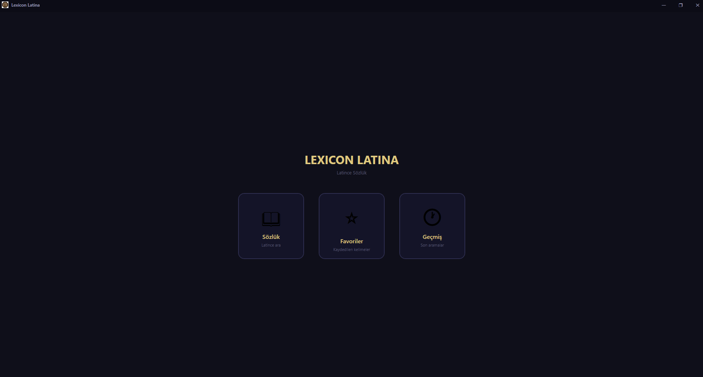
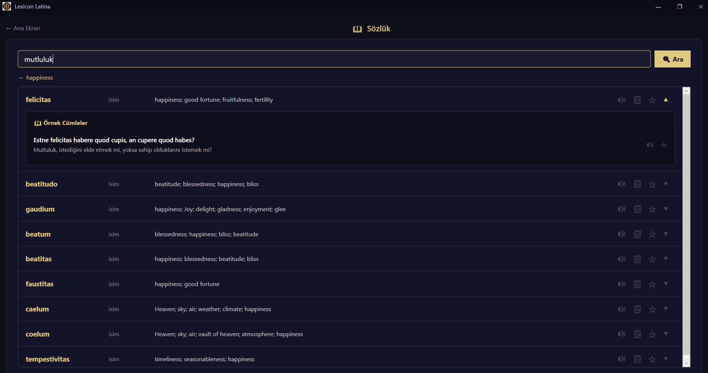
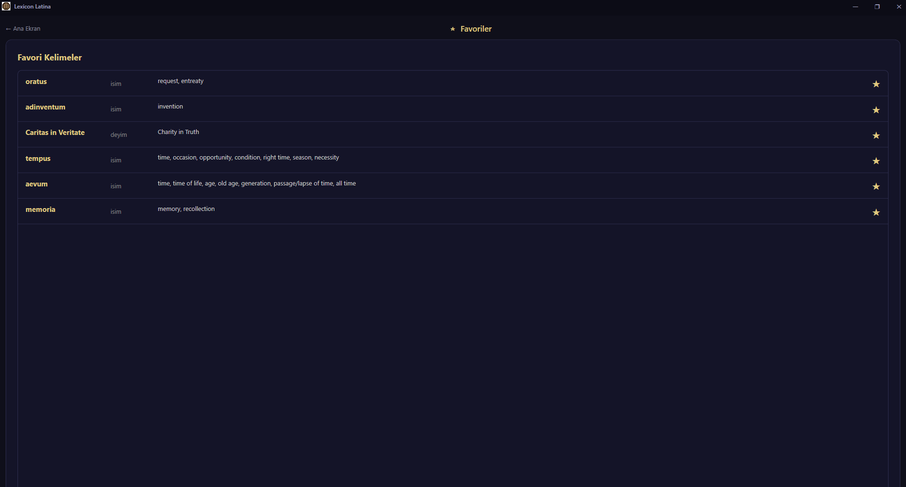

# Lexicon Latina

Türkçe kelimelerden Latince karşılıklarını bulan Windows masaüstü sözlük uygulaması.

---

## Ekran Görüntüleri

| Ana Ekran | Sözlük |
| :---: | :---: |
|  |  |

| Favoriler | Geçmiş |
| :---: | :---: |
|  |  |

---

## Nasıl Çalışır?

1. Kullanıcı Türkçe bir kelime girer.
2. Uygulama, kelimeyi Google Translate üzerinden İngilizceye çevirir.
3. Çevrilen kelime Latin is Simple API'sine gönderilir ve eşleşen Latince kelimeler, türleri (isim, fiil, sıfat, deyim) ve anlamlarıyla birlikte listelenir.
4. Sonuçlar favorilere eklenebilir. Tüm favoriler ve arama geçmişi yerel olarak saklanır.

---

## Özellikler

- Türkçe → İngilizce → Latince çift aşamalı akıllı arama
- Kelime türü ve kısa anlam bilgisiyle detaylı sonuçlar
- Favoriler (kalıcı, `.json` formatında yerel kayıt)
- Son 10 aramayı gösteren arama geçmişi
- Koyu tema, özelleştirilmiş pencere çerçevesi

---

## Teknoloji

- .NET 10.0 / WPF
- MVVM mimarisi
- Google Translate (kayıtsız, ücretsiz endpoint)
- [Latin is Simple API](https://www.latin-is-simple.com/)

---

## Kurulum

[Releases](https://github.com/mirmehmet/lexicon-latina/releases) sayfasından `.exe` dosyasını indirip çalıştırın. Kurulum gerektirmez.

Derlemek için:

```bash
git clone https://github.com/mirmehmet/lexicon-latina.git
cd lexicon-latina
dotnet run
```
---

*Made with curiosity by [Mir](https://github.com/mirmehmet)*
